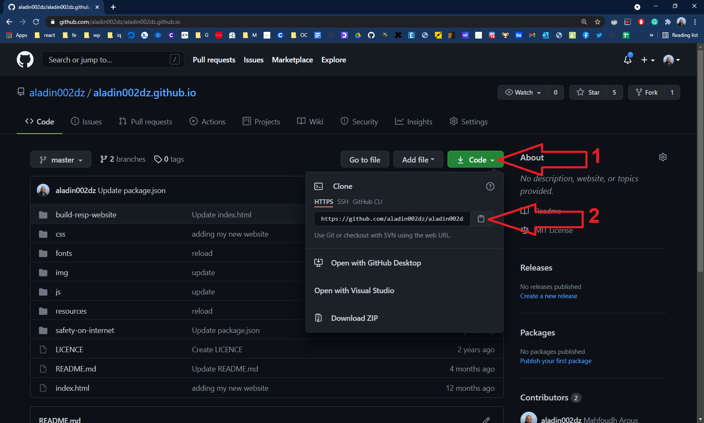
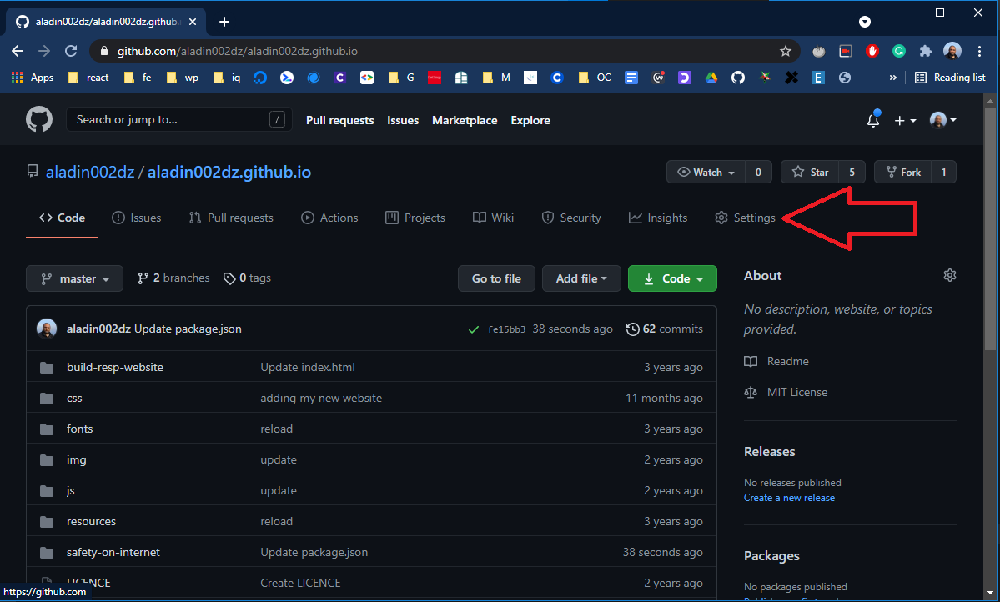
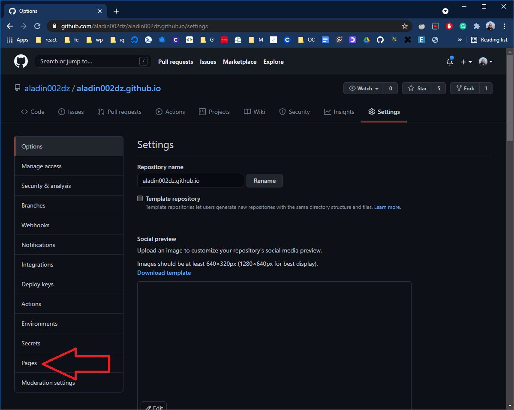
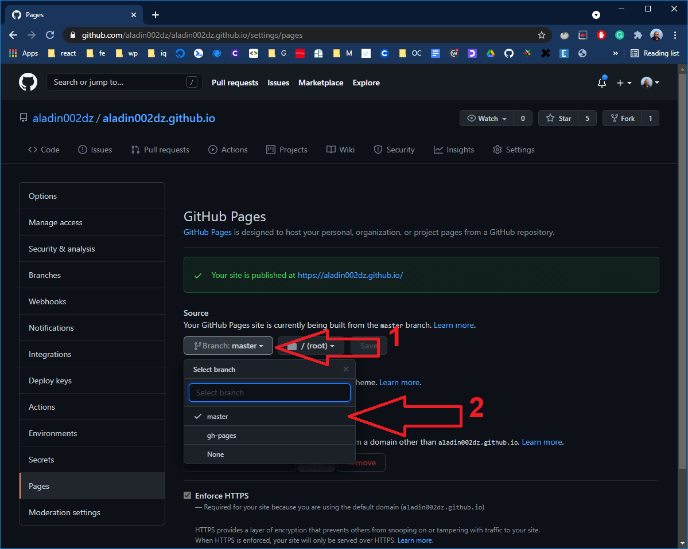
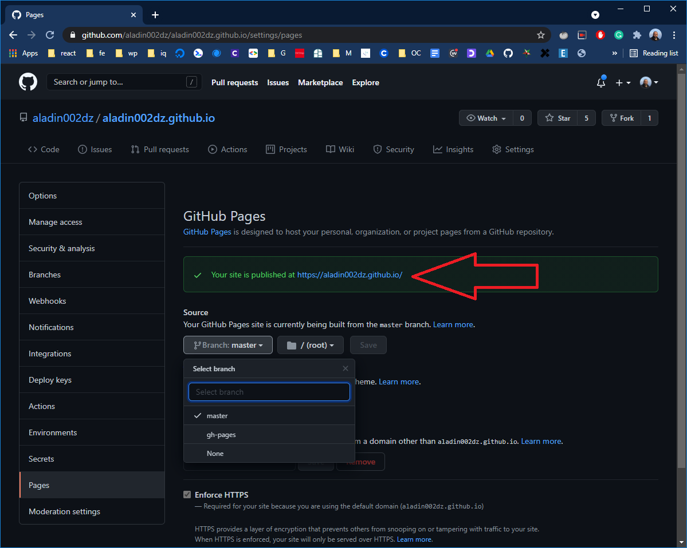

# Déployer sur GitHub Pages
1- Sur GitHub, créer un repo public nommé: "`username`.github.io", (`username`: c'est votre nom d'utilisateur sur GitHub, dans mon cas c'est `aladin002dz`).

2- Cloner le repo sur ton ordinateur (noter que `username` ci dessous, c'est votre nom d'utilisateur GitHub):  
Recupérer l'URL du repo  

```sh
~$ git clone https://github.com/username/username.github.io
```
3- 
```sh
~$ cd username.github.io
```
4- Créer un fichier <b>index.html</b>, avec un peu de contenu dedans, ensuite:
```sh
~$ git add .
~$ git commit -m "Deploiement sur GitHub"
```
5- Envoyé vers github:
```sh
~$ git push
```
6- Sur le menu du repo, aller sur "setting -> pages -> source", choisir le branch contenant la version à déployer, et vous allez avoir une confirmation de publication:
1. Repo <b>"Settings"</b>:

  
2. Naviguer vers <b>"Pages"</b>:

  
3. Choisir la branche:

  
4. Recevoir le message de confirmation:

  
  
6- C'est bon, sur votre navigateur, visiter le lien:  
  https://`username`.github.io  
dans mon cas c'est: https://aladin002dz.github.io

7- Pour deployer un autre repo c'est les mêmes étapes, le lien serait:  
  https://`username`.github.io/nom_repo   
dans mon cas, et pour ce repo qui nommé `Deploiement_GitHub-Pages` c'est: https://aladin002dz.github.io/Deploiement_GitHub-Pages/   

## Remarque
* Ce n'est plus nécessaire d'utiliser la branche <b>"gh-pages"</b> comme auparavant.
* Parfois la mise en ligne prend quelque temps, donc il faut attendre avant de vérifier.
